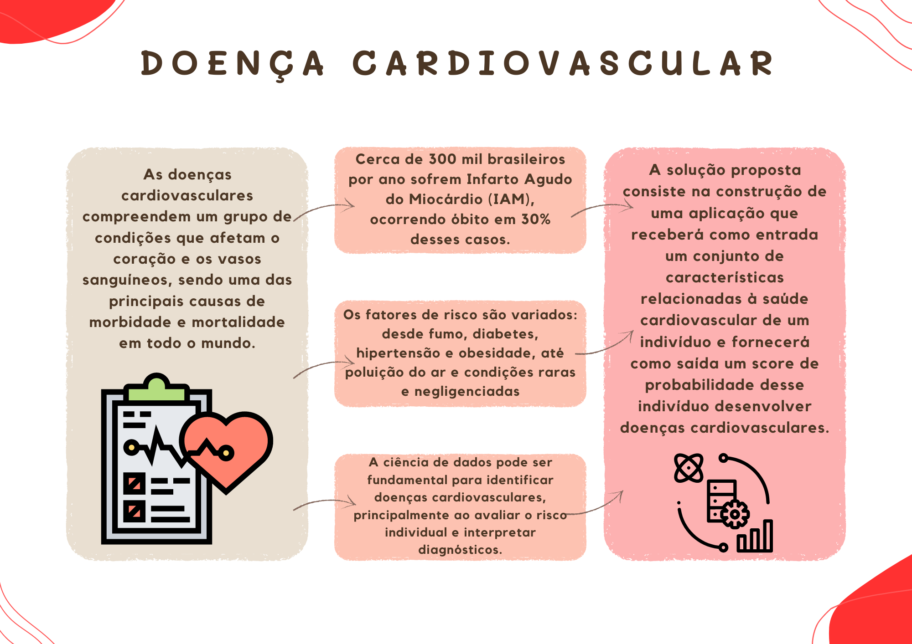

# Heart Disease

A doença cardiovascular afeta o coração e os vasos sanguíneos. O diagnóstico é geralmente feito por meio de exames como eletrocardiograma, ecocardiograma e análise de lipídios no sangue, os quais podem variar em custo, sendo alguns acessíveis e outros mais caros. Além disso, podem ser considerados trabalhosos para os pacientes. Visando melhorar a qualidade de vida dos envolvidos e detectar a doença no seu estagio inicial, nosso projeto tem como objetivo entregarmos um modelo preditivo para doenças cardiovasculares baseadas em uma entrada de dados que costumam apontar a existência dessas doenças. Queremos também entregar uma predisposição de doenças cardiovasculares baseadas em uma entrada de dados que costumam apontar a existência dessas doenças. Utilizaremos o conjunto de dados [Heart Disease](https://www.kaggle.com/datasets/mexwell/heart-disease-dataset) para o desenvolvimento do projeto. 

### Resumo Gráfico

## Desenvolvedores
 - [Bruno Matsuyama Pereira Takazono](https://github.com/brunotakazono/brunotakazono)
 - [Lucas Maurício Braga](https://github.com/LuksMB)
 - [Pedro Vitor Lima Cavalcante](https://github.com/pedrovlcavalcante)
---
